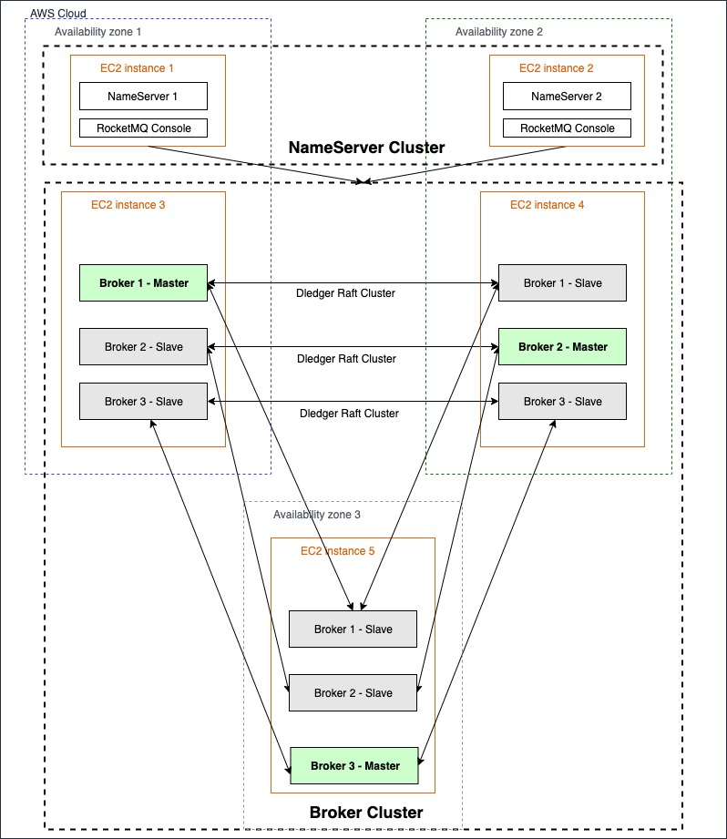

# Apache RocketMQ on the AWS Cloud

[中文](./README.zh.md)

This solution provides a one click CloudFormation deployment to sets up a high available Apache RocketMQ cluster on AWS environment.

Apache RocketMQ is a unified messaging engine as well as lightweight data processing platform. The RocketMQ on AWS solution enables customers to quickly deploy a RocketMQ cluster in AWS Cloud. The basic cluster settings such as EC2 instance types are also configurable during the deployment.

The Quick Start offers two deployment options:

- Deploying Apache RocketMQ into a new virtual private cloud (VPC) on AWS
- Deploying Apache RocketMQ into an existing VPC on AWS

You can also use the AWS CloudFormation templates as a starting point for your own implementation.

## Architecure

For architectural details, best practices, step-by-step instructions, and customization options, see the
[deployment guide](https://www.amazonaws.cn/solutions/RocketMQ/).

## Deploy via CloudFormation

**Time to deploy:** Approximately 15 minutes.

Follow the step-by-step instructions in this section to configure and deploy the AWS Data Replication Hub into your account.

1. Make sure you have sign in AWS Console already.
1. Click the following button to launch the CloudFormation Stack in your account.
   
   | Region        | Type           | Launch Button  |
   | ------------- |:-------------| -----:|
   | Global Region      | Launch to new VPC |     |
   | Global Region      | Launch to existing VPC |     |
   | China Region      | Launch to new VPC |     |
   | China Region      | Launch to existing VPC |     |
   
1. Update required CloudFormation parameter, please refer to [deployment guide](https://s3.cn-north-1.amazonaws.com.cn/aws-dam-prod/china/Solutions/Apache_RocketMQ_on_AWS/apache_rocketmq_on_aws_deployment_guide.pdf)
1. Click **Next** and select **Create Stack**.

#### Manual Deploy Steps
If you updated the code in this repo, you can use following steps to manually deploy updated templates and code to your own s3 bucket.
1. clone this repo
2. use  "aws configure" to setup the aws credential and region  
3. go to scripts directory inside the local repo directory
4. run "bash deploy.sh" and enter the parameters needed. it will trigger a CloudFormation deploy to your aws account.

#### How to access Apache RocketMQ console
1. From AWS Console, get the bastion public address and username
2. Set up a ssh tunnel to the bastion host, similar to this [guide](https://docs.aws.amazon.com/emr/latest/ManagementGuide/emr-ssh-tunnel-local.html)
3. From AWS Console, get the Name Server private  ip address, in browser, enter "NAME_SERVER_PRIVATE_IPADDRESS:8080" to access the console.